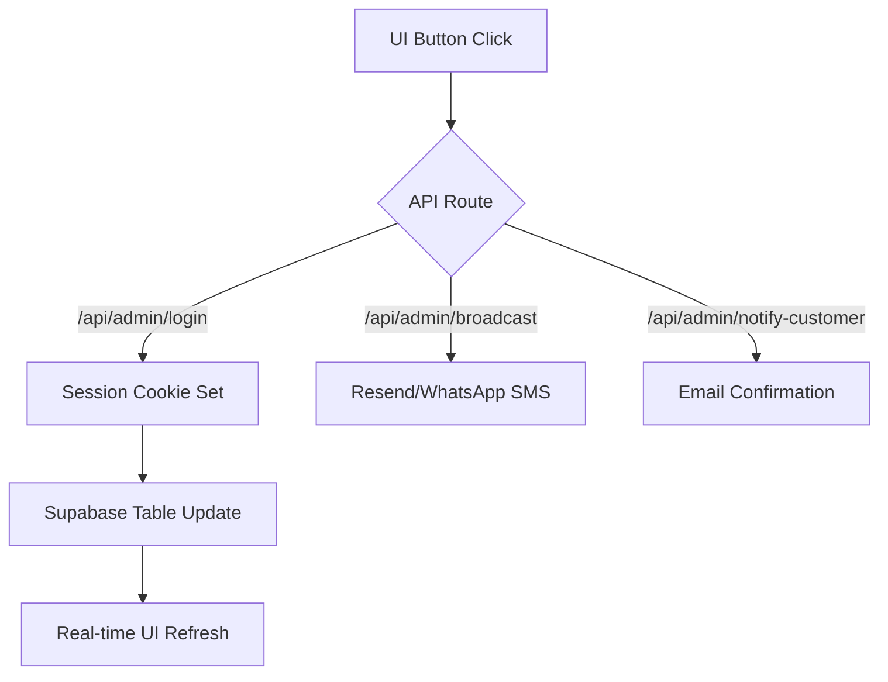

# Connectivity Blueprint - Titan Hub 🌐

This document maps the primary UI components to their underlying Supabase infrastructure and API routes to ensure total system transparency.

## 1. Web Core Infrastructure

| Web Component | Supabase Table | Purpose |
| :--- | :--- | :--- |
| [Warehouse Hub](/admin/upload) | `products` | CRUD operations for stock, pricing, and media. |
| [Orders Pipeline](/admin/orders) | `orders` | Real-time status management (Pending -> Delivered). |
| [Dispatch Center](/admin/dispatch) | `rider_status` | Rider geolocation and tactical assignment. |
| [Analytics Hub](/admin/analytics) | `orders` | High-fidelity revenue and profit extraction. |
| [Campaign Hub](/admin/broadcast) | `newsletter_subscribers` | Audience segmentation and automated messaging. |
| [Command & Control](/admin/staff) | `staff` | RBAC (Role Based Access Control) management. |
| [Document Vault](/admin/vault) | `admin_vault` | Secure document storage with audit logging. |

## 2. Rider Ecosystem

| Service | Infrastructure | Action |
| :--- | :--- | :--- |
| **Authentication** | `rider_status` | Direct PIN/Phone verification via `/api/admin/login`. |
| **Earnings** | `rider_wallets` | Automated credit upon mission completion. |
| **Quests** | `rider_quests` | Gamified milestones for delivery operators. |
| **Telemetry** | `maintenance_logs` | Tracking unit health and service cycles. |

## 3. Android Mobile Bridge

The Android application (`app_android`) acts as a secure "Mobile Controller" for the ecosystem.

- **Bridge Type**: Native WebView with Hardware Acceleration.
- **Primary Endpoint**: `https://tech-paxv.onrender.com/admin` (Configurable in `MainActivity.kt`).
- **Security**: Requires Internet Permission and Cleartext support for Render.com SSL handshake.

## 4. Meta Ecosystem Integration (Ads & IG) 🛰️

To connect your code with Facebook/Instagram logic, follow these steps:

### A. Meta Pixel Tracking (Ads)
1. **Pixel ID**: Get your ID from [Meta Events Manager](https://business.facebook.com/events_manager).
2. **Environment**: Add `NEXT_PUBLIC_FB_PIXEL_ID=your_id_here` to your `.env.local`.
3. **Logic**: The code automatically tracks `PageView`, `ViewContent` (Quick Look), `AddToCart`, and `Purchase`.

### B. Instagram Graph API (Posting)
1. **Developer App**: Create an app at [Meta for Developers](https://developers.facebook.com/).
2. **Permissions**: Request `instagram_basic`, `instagram_content_publish`, and `pages_read_engagement`.
3. **System Token**: Generate a **Permanent Page Access Token**.
4. **Environment**: Add `META_ACCESS_TOKEN` to your server environment.
5. **Logic**: Use the `/api/admin/broadcast` route to bridge the "Campaign Builder" content to the IG Graph endpoint.

## 5. Data Integrity Map (UI -\u003e DB) 🗺️

| Feature | Primary UI File | Database Table | Trigger Action |
| :--- | :--- | :--- | :--- |
| **Sales Analytics** | `analytics/page.tsx` | `orders` | Reads `Delivered` orders. |
| **Abandoned Cart** | `AbandonedCartBar.tsx` | `abandoned_carts` | Reads from email match. |
| **Stock Tracking** | `ProductCard.tsx` | `products` | Real-time subtraction logic. |
| **Rider Payouts** | `dashboard/page.tsx` | `rider_wallets` | `credit_rider_wallet` RPC. |
| **Staff Control** | `staff/page.tsx` | `staff` | RBAC permission state. |
| **Security Audit** | `audit/page.tsx` | `audit_logs` | `logAuditAction` service. |

## 6. System Setup Commands

## 5. Environment Synchronization

Ensure your `.env.local` is synchronized with these keys:
- `NEXT_PUBLIC_SUPABASE_URL`: Your Project URL.
- `NEXT_PUBLIC_SUPABASE_ANON_KEY`: Your Service Role/Anon Key.
- `ADMIN_PASSWORD`: Your Master Owner PIN.
- `RESEND_API_KEY`: For Broadcast Email delivery.
